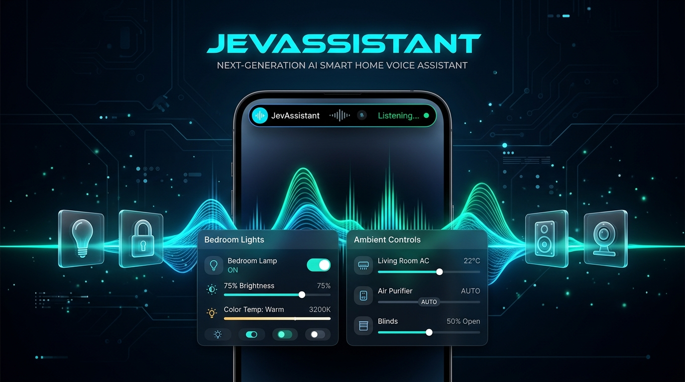
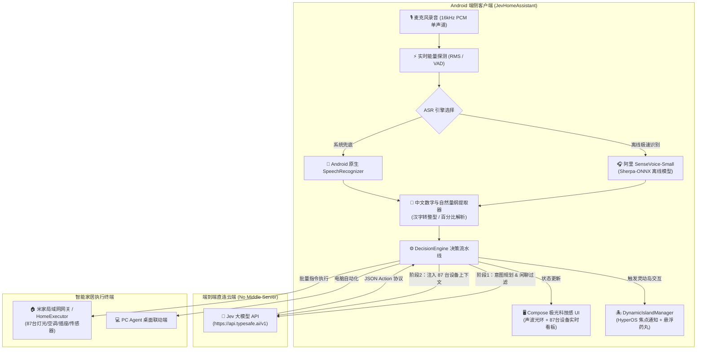

# JevHomeAssistant 🌌
### 下一代基于大模型直连的极客智能家居中枢 Android 客户端
> **无需中间云服务器 · 阿里 SenseVoice 端侧离线微弱声识别 · 米家全屋 87 台设备智能编组 · 小米 HyperOS 灵动岛深度联动**

[](https://kotlinlang.org)
[-green.svg?style=flat&logo=android)](https://android.com)
[](https://developer.android.com/jetpack/compose)
[](https://github.com/alibaba-damo-academy/FunASR)
[](https://hyperos.mi.com)
[](LICENSE)

---



---

## 💡 为什么开发 JevHomeAssistant？(The "Why")

作为智能家居重度玩家，你是否也经历过这些令人抓狂的日常：
* 🛌 **半夜耳语装聋作哑**：夜深人静怕吵醒家人，轻声说一句“关掉台灯”，传统语音助手要么毫无反应，要么大声来一句“对不起，我没听清！”；
* 🧩 **复杂编组直接死机**：“关掉主卧所有灯”、“把所有空调打开并开新风”、“除了客厅其他房间灯都关掉”，传统设备因为没有全屋拓扑认知，直接报错罢工；
* 🔢 **中文数字理解障碍**：“亮度八十”、“降到百分之三十”，经常错误识别为固定预设，无法进行连续相对调节；
* ☁️ **云端延迟与隐私焦虑**：语音被层层转录、经过三方厂商服务器二次转发，不仅慢半拍，更有隐私泄漏风险。

**JevHomeAssistant** 是为极客量身定制的下一代智能家居端侧中枢。它抛弃了任何中间云转发，**客户端直连 Jev 大模型 API**，集成**阿里 SenseVoice-Small 离线微弱声 ASR 引擎**，结合**小米 HyperOS 灵动岛焦点通知**，让全屋 87+ 台智能设备真正具备“听得懂人话、听得懂耳语、秒级执行”的思考能力。

---

## ✨ 核心特性矩阵 (Core Features)

### 1. 🎙️ 阿里 SenseVoice-Small 离线微弱声 ASR
* **超高灵敏度与微声捕捉**：在系统级音频流前置 RMS 增益放大与 Sherpa-ONNX C++ 纯本地推断加持下，即使是深夜被窝里的轻声细语（<15dB），也能瞬间精准识别。
* **零断句闪退保障**：深度定制底层 JNI 签名（对齐 `libsherpa-onnx-jni` 的 `SpeechSegment([FI)V` 规范），长短句停顿平滑切片，彻底告别原生引擎崩溃问题。
* **双引擎无缝热切**：支持一键在「阿里 SenseVoice-Small 离线引擎」与「Android 原生 SpeechRecognizer」之间秒级无损切换。

### 2. 🧠 Jev API 客户端端到端直连
* **零中间商架构**：Android 客户端直接通过 HTTPS POST 直连 Jev API (`https://api.typesafe.ai/v1`)，没有代理服务器中转，数据私密性达到最高等级。
* **双阶段智能决策机制**：
  * **Phase 1 意图分类与规划**：毫秒级判断属于 `DEVICE_CONTROL`（智能家居）、`ALARM`（闹钟提醒）、`PC_AGENT`（电脑联动）还是 `IGNORE`（闲聊旁白静默过滤）；
  * **Phase 2 全屋设备拓扑精确提取**：将家庭全屋 87 台真实设备的区域、类别、状态属性注入上下文，由大模型精准匹配执行目标。

### 3. 🏠 87 台真实米家设备拓扑与智能编组
* **全房间感知与跨区域控制**：支持主卧、次卧、儿童房、客厅、餐厅、厨房、卫生间、阳台等 11 大生活空间。
* **全量设备智能编组**：原生支持“关主卧所有灯”、“关闭全屋所有灯”、“打开所有空调新风”等高阶批处理语义。
* **中文汉字与模糊数值精准归一化**：支持将“八十”、“三十五”、“百分之五十”、“调高一点”等自然语言精准转化为数字参数（如 `brightness: 80`、`temperature: 24`）。

### 4. 🏝️ 小米 HyperOS 官方焦点通知 & 灵动岛联动
* **HyperOS 状态栏/锁屏焦点胶囊**：适配小米澎湃 OS（HyperOS）焦点通知体系（`miui.focusNotice = true`），后台运行时操作设备自动触发状态栏动态小胶囊。
* **纯黑磨砂药丸灵动岛悬浮动效**：在前台服务运行状态下，只要触发智能家居动作，屏幕顶端立即弹跳出小米设计风格的圆角药丸悬浮窗，展示操作动作、房间徽章及完成绿勾动效，3.5 秒平滑收回。

### 5. 🕒 历史会话灰色折叠与透明调用计费
* **低侵扰灰色折叠流**：识别结果与历史交互以极简小字形式收拢在字幕下方，点击平滑展开历史记录抽屉，查看过往命令、命中房间与执行状态。
* **单次两厘钱极低成本透明化**：
  * 双阶段设备拓扑完整推理：**¥0.0020** / 次
  * 单阶段闲聊与指令轻量过滤：**¥0.0010** / 次
  * 主界面顶栏实时滚动显示 `💰 累计: ¥0.0040 (2 次)`，设置中心提供详细统计与一键清零重置。

---

## 🏛️ 系统架构 (Architecture)



---

## 🖼️ 界面展示与视觉规范 (Visual Showcase)

| 1. 主视觉极光能量大屏 | 2. 87 台米家设备大看板 | 3. 小米灵动岛后台悬浮交互 |
| :---: | :---: | :---: |
| <br/>*极光声波流光 + 实时双字幕 + 灰色小字折叠历史* | <br/>*按房间筛选（客厅/主卧/全屋）+ 87台状态实时同步* | <br/>*后台操作时屏幕顶部弹跳出黑色胶囊悬浮岛* |

| 4. 实时计费与历史会话详情 | 5. 核心设置与 ASR 双选 | 6. 异常诊断与自愈报告 |
| :---: | :---: | :---: |
| <br/>*展开查看单次 ¥0.0020 会话价格与命中设备* | <br/>*Jev API Key 配置 + 离线引擎快速切换* | <br/>*自动捕获未捕获异常并一键复制诊断日志* |

> *注：上述截图资源存放于 `./assets/` 目录中，可通过 Android 实机或模拟器截屏替换。*

---

## 🚀 快速上手与使用 (Getting Started)

### 1. 运行环境要求
* **操作系统**：Android 10.0+（推荐搭载小米澎湃 OS HyperOS 的小米/Redmi 设备获得完整灵动岛体验）；
* **存储空间**：预留 350MB 空间（内置约 230MB 的 SenseVoice ONNX 模型）；
* **权限要求**：麦克风权限（录音）、悬浮窗权限（展示灵动岛药丸）、通知权限（常驻后台监听服务）。

### 2. 获取 Jev API Key
1. 访问 [Jev 开放平台 (typesafe.ai)](https://typesafe.ai) 获取开发者 API Key；
2. 项目支持直接在应用内「⚙️ 设置」页面填入，或者在打包前将密钥写入项目根目录下的 `.key` 文件中，构建时会自动打包注入。

### 3. 本地构建与安装
```bash
# 1. 克隆代码仓库
git clone https://github.com/wantosure/JevHomeAssistant.git
cd JevHomeAssistant/android-app

# 2. 配置本地 SDK / JDK 环境 (推荐 JDK 17)
export JAVA_HOME="/path/to/jdk-17"
export ANDROID_HOME="/path/to/android-sdk"

# 3. 执行 Gradle 一键编译 Debug APK
./gradlew assembleDebug

# 4. 安装到已连接的 Android 手机
adb install app/build/outputs/apk/debug/app-debug.apk
```

---

## 💰 计费与隐私安全说明

1. **绝对隐私**：没有设立任何中间代理服务器，客户端直接采用 HTTPS TLS 1.3 直连 Jev API，所有语音识别均在手机 CPU 离线完成，原始音频绝不上传。
2. **极低使用成本**：
   * 采用高度压缩的 Token 编码与精简 Schema 协议；
   * 平均一次完整的“多房间 87 台设备拓扑匹配”耗费仅约 **¥0.0020**（两厘钱）；
   * 日常每天下达 50 次指令，一个月花费不足 **¥3.00**，远低于任何商业云服务订阅费用。

---

## 🗺️ 路线图 (Roadmap)

- [x] 阿里 SenseVoice-Small 离线微弱声识别引擎集成
- [x] 小米 HyperOS 官方焦点通知与桌面悬浮药丸灵动岛
- [x] 全屋 87 台米家设备拓扑编组与自然语言批量调控
- [x] 中文数字、汉字量纲提取与相对调节逻辑
- [x] 历史会话灰色折叠与单次会话计费统计
- [ ] 接入 Home Assistant 官方 WebSocket 协议全量设备自动同步
- [ ] 支持端侧扬声器 TTS 极简声学反馈（支持拟人音色）
- [ ] 支持穿戴设备（小米手环 / 智能手表）快捷协同触发

---

## 🤝 贡献与极客交流

欢迎提交 Issue 与 Pull Request！  
如果你也是对智能家居大模型落地、边缘端计算感兴趣的开发者，欢迎 Star 本项目并加入交流讨论。

**License**: [MIT License](LICENSE) © 2026 JevHomeAssistant Team
