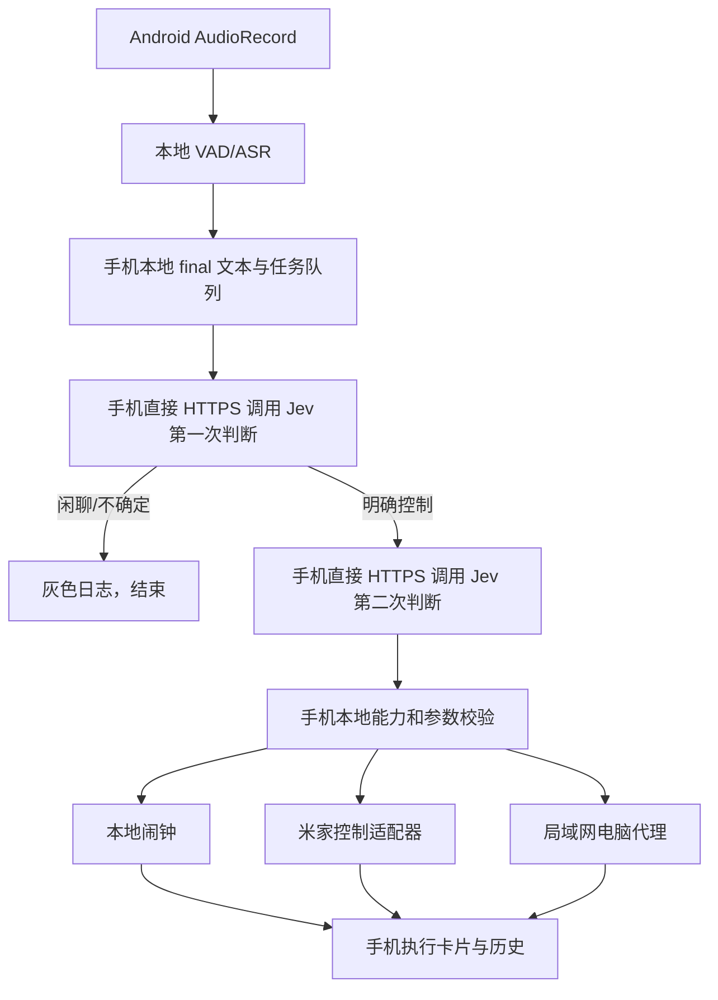

# 安卓静默语音助手：无云端服务技术设计

版本：2.0 · 2026-09-24。需求以 [需求文档](requirements.md) 为准，设备 ID 和标准动作以 [设备协议](device-control-contract.md) 为准。

## 1. 关键结论

**App 可直接调用 Jev。** 当前项目的 Jev 请求本质是 HTTPS JSON：`POST https://api.typesafe.ai/v1/systemone`，请求体含 `state/model/questions`。把这段请求和两阶段构造逻辑移到安卓 App 即可完成分类与参数判断，不需要为 Jev 另建服务端。

直接调用只解决“理解命令”。真正的米家控制还需要可用的设备执行接口及物理映射，电脑控制需要局域网代理；不能把自定义 ID 或模型输出当成米家 API。OCI 与 `bitcoin001.cn` 在首版不使用。若将来要跨网控制、共享多手机状态或让 API Key 不落在客户端，再单独评估云端服务。

## 2. 架构与模块

建议 Kotlin + Compose + 前台服务 + AudioRecord + sherpa-onnx + OkHttp + Room。以 repository/interface 分层：AudioPipeline、TranscriptSegmenter、JevClient、DecisionEngine、DeviceRegistry、HomeExecutor、AlarmExecutor、PcExecutor、RunRepository、RunEventSink。

所有状态在手机本地。Room 表：utterances、runs、run_events、operations、devices、capabilities、alarms、settings。事件先落本地库，再驱动 UI；App 重启后恢复历史和不明任务状态。取消云端 Worker、PostgreSQL、配对、Caddy 和 WSS 依赖。

## 3. 安卓生命周期和音频

用户在可见 Activity 授权并点击开始，启动 microphone 类型前台服务，提供持续通知和暂停。退到后台不结束服务；暂停确实释放麦克风。系统中断、权限撤销、音频被占用需显示错误。后台/开机自动启动受 Android 限制，不能承诺永远无感恢复。[Android 前台服务说明](https://developer.android.com/develop/background-work/services/fgs/service-types)

采集单声道 PCM，初始 16 kHz，以选定模型要求为准。VAD 约 300 ms 前置缓冲、700 ms 静音端点、单段最长 20 秒，均可调。流式 ASR 本地更新字幕；final 才可正式决策。截断段、不完整句、空文本不执行。默认不落盘原始录音。[sherpa-onnx](https://github.com/k2-fsa/sherpa-onnx)

不使用系统 SpeechRecognizer 循环调用做全天识别。模型文件锁定版本、SHA256、许可和分发方式；选择模型依据目标真机中文识别、速度、内存与温升。屏幕无需常亮。

## 4. JevClient 与两阶段判断

Android 通过 OkHttp HTTPS 调 Jev，`Authorization: Bearer <用户配置的 Key>`，只在内存中形成请求头；Key 不写日志。网络超时初始 8 秒，遇 429/5xx 使用有上限的退避；已过期语音不重试执行。

第一阶段同一 `questions` 中提供两个自定义选择问题：`engagement` 选 actionable/ignore/uncertain；`intent` 选 home_control/alarm/computer_control/daily_chat/other。`state` 含 final 文本、默认房间、手机当前时区与时间、有限已接受上下文。忽略和闲聊仅写灰色日志，不调用聊天模型。

第二阶段根据 intent 构建封闭候选：家居选设备/组、动作和参数；闹钟选时间候选与增改删动作；电脑选白名单动作/参数。请求可同次提出多个独立问题，后续问题依赖先前结果时才串行调用。实际请求与响应字段以现有 `jev_server.py` 和真实 API 结果校验，不把自定义 ID 当固定 API 字段。

模型结果不得直接执行。校验置信度存在且为有限数字、目标在候选中、设备确有该能力、参数类型/范围/步长/枚举合法、操作未过期、无否定或复合指令误读。数值 0 合法时不能因真假判断忽略。阈值按介入、业务、目标、参数配置，observe 阶段用样本校准，不将模型置信度等同实际正确率。

### 4.1 API Key 取舍

首次使用时由用户输入自己的 Jev Key，利用 Android Keystore 支持的加密存储；切勿硬编码、上传仓库、写到设备目录、Crash 报告或普通日志。支持显示“已配置”、更换与清除，不明文回显。App 备份应排除密钥材料。

客户端直连无法获得服务端保管密钥的安全边界。设备被控制、Root、调试或逆向时 Key 仍可能泄露；作为单人 Demo 可以接受这一明确风险，但开发者不可宣称 Key 不可提取。可在供应方可用时为此 Key 配置额度与轮换策略。

## 5. 本地任务与幂等

为每个 final 生成稳定 utterance_id 和 run_id，Room 对 `(session_id, utterance_id)` 设唯一约束。收到重复 final 返回原 run，不再调用 Jev 或执行。partial 只在内存中更新。

状态：accepted → deciding → validating → executing → succeeded/partial/failed/unknown；执行前可 ignored/needs_input/expired；observe 终态 planned。执行动作另建稳定 operation_id，先记录计划后下发。

所有真实操作经单一本地执行队列，按 final 接收顺序处理；同设备不得乱序。初始一个家庭至多一个正在产生副作用的任务。决策可按需要有限并行，但后一条不能越过先前未完成的控制而执行。过期、App 重启或响应丢失时不盲目重放非幂等动作；先查询设备状态，未知标 unknown。

初始语音年龄上限 10 秒，开始产生副作用的期限为 final 生成后 15 秒，可配置。每段 final 第一阶段最多一次，明确控制才第二阶段；静音期间没有 Jev 请求。用户关掉观察模式前，设备动作仍需 verified 映射。

## 6. 设备目录和实际控制

用户截图来源为米家极客版，包含真实家庭设备名称、房间及可用性分组。按 [设备协议](device-control-contract.md) 自行分配稳定逻辑 ID 和标准参数，转录完整截图，截断名称标待确认。设备能力模板是内部规范，不表示物理设备已经支持。

注册表字段至少：logical_id、source_system、source_device_id（可空）、name、room、aliases、availability、capabilities、mapping_status、registry_version。mapping_status 为 draft/mapped/verified/disabled。observe 可用 draft 计划；live 只能使用 verified 且 enabled 的能力。

`HomeExecutor` 契约：listDevices、getCapabilities、execute、readState。先实现 ObserveExecutor；实际适配器须基于可验证的米家/家庭自动化接口填入物理 ID、属性/动作与认证。若有官方或已部署的家庭接入方式，开发者应验证真实 API；截图和自定义 ID 不构成调用凭据。无映射返回 device_not_connected，不得模拟成功。

手机若需访问家庭局域网控制接口，固定手机和控制网关在同 LAN；不能假设米家 App 提供可被第三方直接调用的本地接口。若需一个家庭桥接组件才能调用真实设备，这属于**设备执行适配器**，应具体说明其所在设备和安装方式；用户说“不需要服务端”指不为 Jev 建独立云端业务服务，不能据此伪装已有米家控制能力。

尽量使用 set_power、set_temperature 等幂等“设置为”动作，避免 toggle 或“加一级”。设备组完整校验后逐台执行，记录确认/失败/未知。传感器只读、无线按钮为事件输入、门锁首版不提供语音开锁。

## 7. 闹钟与电脑

闹钟由程序而非 Jev 做日期/时区运算，Room 持久化、AlarmManager 注册；手机实际成功注册后显示“已设置”。按目标 Android 版本检查精确闹钟权限。重启和时区变化后重算，断网后已设置的闹钟继续工作，关机/强制停止不保证。[Android 闹钟](https://developer.android.com/develop/background-work/services/alarms)

电脑控制只在手机和电脑互通的局域网内作为首版功能。Windows 代理可提供受令牌保护的局域网 HTTPS/安全连接，限制来源和动作，绝不开放任意命令。首批 set_volume(0..100)、pause_media、open_app(白名单 app_id)。代理在当前交互用户会话启动，持久化 operation_id 防重复。不可达/失败显示未执行，不补执行隔夜命令。具体传输由开发者选择可在手机与电脑环境中验证的方式，不绑定 OCI 域名。

## 8. 页面

首页顶部显示“监听中/暂停/错误”、Jev 连接、observe/live 和默认房间；中部显示实时字幕与控制卡片；底部灰色小字日志。普通聊天只写“日常聊天，已忽略”。卡片依本地真实事件显示分类、目标、参数、校验、下发、状态确认，不生成假进度。

日志默认展示最近 20 条，总量有界，支持字体缩放。后台不自动拉起页面，不播放 TTS。设置页处理 Key、阈值、房间、设备映射和数据清理。执行历史区分 planned、accepted、confirmed、unknown、failed。

## 9. 测试与交付

测试：API 响应契约与异常/429；重复 final；中文数字与 0；房间冲突、设备组、越界；电视/引用/否定；断网和重启；手机闹钟权限；电脑离线。真机完成至少 100 条明确指令、8 小时背景误触发观察、24 小时熄屏为主运行，记录准确率、延迟、温升、内存和中断。真实设备状态变化是 E2E 证据；模拟计划不算。

交付目录建议 `android-app/`、`pc-agent/`、`device-adapters/`、`docs/`、`tests/`；附可安装 APK、模型来源/许可、依赖锁定、设备目录配置、代理安装说明、测试报告。开发顺序：本地 VAD/ASR → Jev 直连 observe → 闹钟 → 真实设备映射 → 电脑代理 → 真机全天测试。

目标手机型号、Jev Key、真实米家控制接口与电脑系统待实际接入时确定。先完成不依赖这些信息的代码和观察模式；不得再要求用户逐台设计逻辑 ID 或标准参数。
